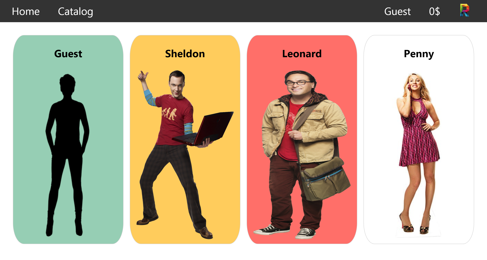
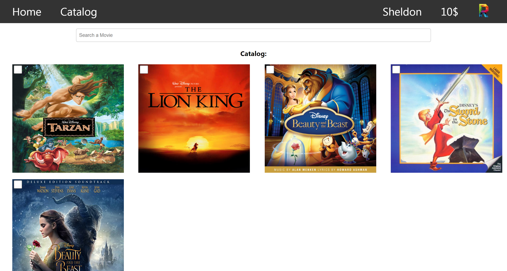
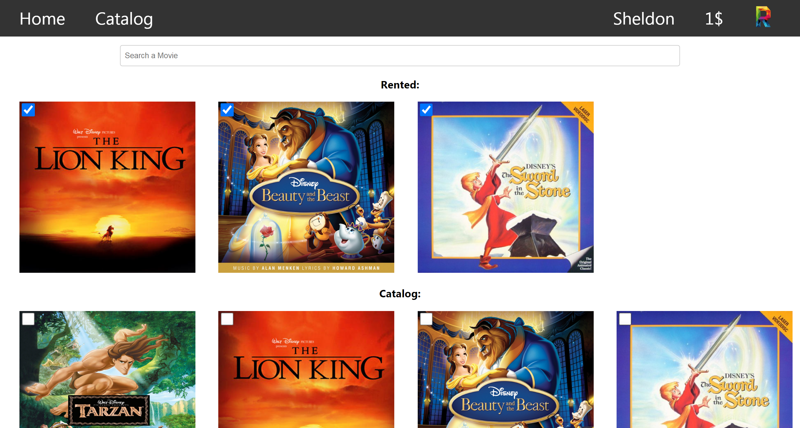
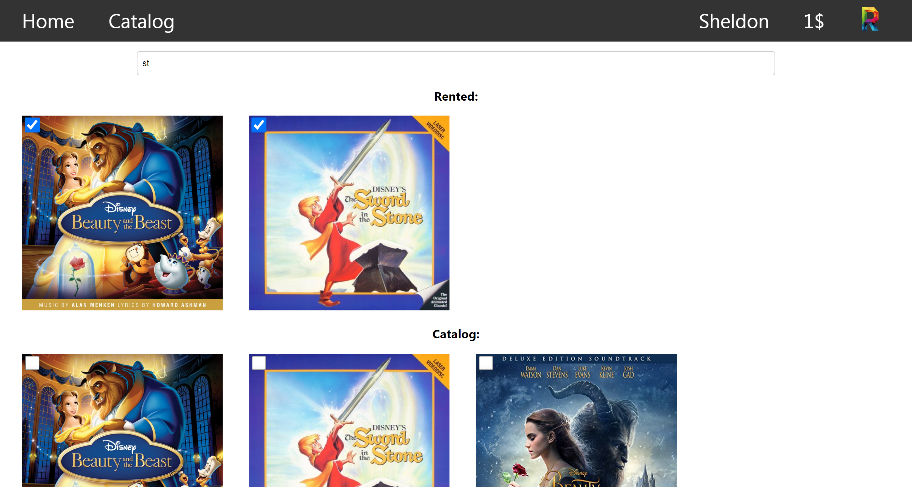
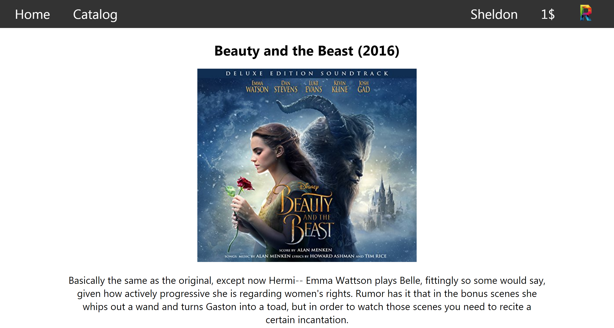

# Reflix Project

Reflix is a Netflix-like Project for renting movies. Data is also persisted with LocalStorage.

## 📷 Project Screenshots

### 🎭 Home

Displays users, each with different budget and rented movies, clicking on any of them will display their catalog page.

 

### 📜 Catalog

Displays available movies, with the ability to rent/unrent (if budget allows) a movie. the user can also search dynamically between movies. clicking on any of the movie will display the movie details page.

### 🎥 Movie Details

## 💻 Technology used

- React, localStorage

## 🔧 Getting Started

- Clone this repository. You will need `node`, `npm` installed globally on your machine.
- run `npm install`
- run `npm start` 

